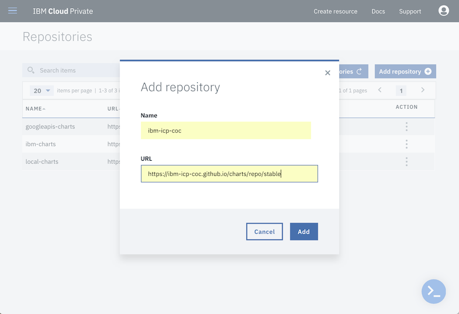
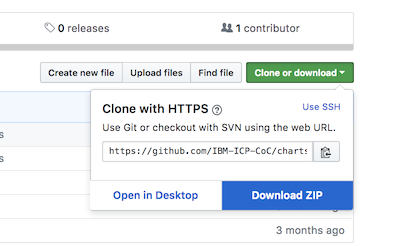

# Adding Helm chart repository

If you are have an ICP cluster that has access to the Internet, and can 
connect directly to DockerHub and GitHub, then adding the repository to 
the list of repositories is trivial.  However if your cluster is air-gapped 
then you will need to go through the steps of copying the docker images to 
the ICP registry and then edit the Helm chart to reference the locally stored 
image.

## Adding the Helm chart to an Internet accessible cluster

Using the main menu (hamburger menu) select **Manage** > **Helm Repositories**.  

Press the Add Repository button.

Enter in a name for the repository (eg. ibm-icp-coc) and use the following URL 

```
https://ibm-icp-coc.github.io/charts/repo/stable
```



Press the Add button.

Press the Sync repositories button to manually initiate a reloading of all the 
Helm repositories that are displayed in the ICP cluster.  This will take
a few minutes. You may experience partial loading of the chart information, 
so if you are looking at the charts shortly after synchronizing you may see
charts without readme files or their descriptions loading improperly.  Just be 
patient, it will settle out soon enough.

## Adding the Helm chart in an air-gapped culster

In order to copy a Helm chart into an air-gapped system you will need to perform steps 
similar to [these](https://www.ibm.com/support/knowledgecenter/en/SSBS6K_2.1.0.2/app_center/add_package_offline.html) 
documented in the ICP on line documentation.  Basically it involves downloading the 
source for the chart, updating one of the files with a new default value, then creating 
a new version of the chart for your cluster.  You also have to get and re-tag a copy of 
the Docker image in your ICP image registry.

These steps require a workstation that has access to the Internet, and has [Docker 
installed](https://docs.docker.com/install/).  Ideally this workstation should also 
have access to the ICP cluster, and have the 
[IBM Cloud CLI with ICP plugins](https://www.ibm.com/support/knowledgecenter/SSBS6K_2.1.0.2/manage_cluster/install_cli.html) 
 installed.  If not this workstation, then another 
can be used, however there must be a way to copy files from the Internet facing workstation, 
and this workstation too must have Docker installed, and [Helm installed](https://docs.helm.sh/using_helm/#installing-helm). 
If the cluster uses the default self-signed certificates, then you will need to make sure that the
Docker installation on the workstation that connects to the cluster includes the cluster in 
its list of insecure registries.  See this 
[documentation](https://docs.docker.com/registry/insecure/) on how to configure it for your Docker 
client.


You also need to know is the name of your cluster.  The default name given at installation 
is `mycluster.icp`, however this could have been changed before installation.  We will assume 
the name `mycluster.icp` in this documentation, however if your name is different you will 
need to substitute your value wherever you see the `mycluster.icp`. 

Finally these instructions will install the chart into the `default` namespace of the image 
registry.  While the chart itself will be visible to every user of the ICP cluster, only those with
operator or administrator rights to that namespace will be able to deploy the chart (pull the image 
from the registry).  These instructions use the `default` namespace in the cluster image registry for 
the KubeToy application.

The rest of these instructions will assume that the workstations are set up and ready to use.

### Download the Helm chart

First we will pull down a copy of the source for the Helm chart.  From the GitHub page:

```
https://github.com/IBM-ICP-CoC/charts
```

Use the UI to download a zip of the entire repository, then unzip the file into some working 
directory on your workstation.  



Change to the `stable/KubeToy` directory of the unzipped archive.  Edit the file `values.yaml`.
Replace the value `ibmicpcoc/kubetoy` with `mycluster.icp:8500/default/kubetoy` and save the file.
This changes the default value for the image to be your ICP cluster's image registry.

Change back to the `stable` directory.  Use the Helm CLI to repackage the chart with the command:

```
$ helm package kubetoy
Successfully packaged chart and saved it to: /Users/jconallen/Downloads/charts-master/stable/kubetoy-1.3.0.tgz
$
```

With the workstation that is visible to the cluster, use the ICP CLI to add the chart to the cluster.  

First we need to initialize the ICP CLI and log into the cluster with the cluster administrator's id.  
From a command prompt enter in the following command using the actual IP address of your cluster 
(or domain name if available).  The default API port is 8443. The skip ssl validation flag is required 
if your cluster is using the default self signed certificates.

```
$ bx pr login -a https://xxx.xxx.xxx.xxx:8443 -u admin --skip-ssl-validation
API endpoint: https://xxx.xxx.xxx.xxx:8443

Password>
Authenticating...
OK

Select an account:
1. mycluster Account (id-mycluster-account)
Enter a number> 1
Targeted account: mycluster Account (id-mycluster-account)

$
```

Next you can upload the chart to the helm repository with the command:

```
$ bx pr load-helm-chart  --archive kubetoy-1.3.0.tgz --clustername mycluster.icp
```

Before the chart can be used, the Docker image must be copied into the local ICP image registry (see below).

### Copy Docker Image

To get a copy of the docker image from the DockerHub into 
the local ICP registry, you will need to pull the 

With the Internet facing workstation use Docker to save a local copy of the KubeToy image.

```
$ docker pull ibmicpcoc/kubetoy:1.3.0
1.3.0: Pulling from ibmicpcoc/kubetoy
605ce1bd3f31: Pull complete
42f3a50489c2: Pull complete
3b358e79ba44: Pull complete
792134464b57: Pull complete
2559646cf479: Pull complete
e2f6d72dbc78: Pull complete
cca9bb2f011e: Pull complete
576f8556822d: Pull complete
d0cde63ea62e: Pull complete
b9b82be48324: Pull complete
689299d96fcb: Pull complete
Digest: sha256:307a68afde2c612de11b8f887b5d445eda9c331959f2f3b9a143bd4d1785d51c
Status: Downloaded newer image for ibmicpcoc/kubetoy:1.3.0
$
```

Now we need to save this as a file.

```
$ docker image save ibmicpcoc/kubetoy:1.3.0 -o kubetoy_1.3.0.tar
```
Verify 

Now on the workstation that is visible to the cluster log into the ICP Docker registry with:

```
$ docker login -u admin https://mycluster.icp:8500
Password:
Login Succeeded
$
```

```
docker tag ibmicpcoc/kubetoy:1.3.0 mycluster.icp:8500/default/kubetoy:1.3.0
$ docker push mycluster.icp:8500/default/kubetoy:1.3.0
The push refers to repository [mycluster.icp:8500/default/kubetoy]
547c43e2fe18: Pushed
0ad6d8de6e98: Pushed
b9165b3a2518: Pushed
76378de5b760: Pushed
3e4ba0b73f3b: Pushed
deb4ca77c2cf: Pushed
ccba7a030ecf: Pushed
25ab38d1a556: Pushed
e18433f9e314: Pushed
3202950b066d: Pushed
9dfa40a0da3b: Pushed
1.3.0: digest: sha256:307a68afde2c612de11b8f887b5d445eda9c331959f2f3b9a143bd4d1785d51c size: 2616
```


