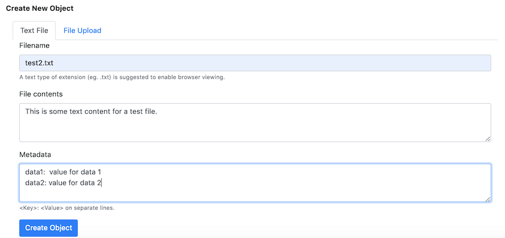
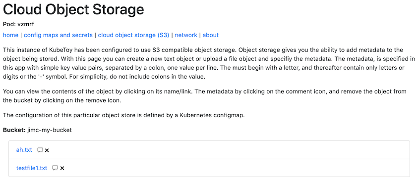

# Cloud Object Storage (S3)

During installation of the chart, the functionality of Cloud Object Storage should have been enabled.
Credentials for a specific object storage (and bucket) could have been supplied at the time, or they 
can be manually created in a configmap after installation.  If your object storage was configured at 
installation time, you can skip to the section Playing with Cloud Object Storage.

## Configuring/Changing Cloud Object Storage (S3) for KubeToy

This application uses the node module [ibm-cos-sdk](https://github.com/IBM/ibm-cos-sdk-js) for interacting with
cloud object storage.  A configMap in ICP is used to pass in configuration information to the API [constructor](https://ibm.github.io/ibm-cos-sdk-js/AWS/S3.html#constructor_details).  Depending on the details of your S3 service provider, you may need to pass in different information.

If you are using the IBM Cloud Object Storage provider, then you can supply the following information as a JSON
object to the API.  Note: the KubeToy application requires the bucket to be specified, along with the other information.

```
{
    "bucket":"my-bucket",
    "endpoint":"s3.us.cloud-object-storage.appdomain.cloud",
    "accessKeyId": "XXXXXXXXXXXXXXXXXXXX",
    "secretAccessKey": "XXXXXXXXXXXXXXXXXXXXXXXXXXXXXXXXXXXXXXXX"
}
```

Instruction on [how to obtain an access key and sceret](https://cloud.ibm.com/docs/iam?topic=iam-userapikey#userapikey) can be found in the IBM Public Cloud documentation.  

With this information you need to edit the configMap that was created during the installation of the Helm chart.  First determine the configMap name by looking for it in ConfigMap page of the cluster UI.  Then configure a termninal session with the cluster's credentials.  Edit the configMap with the following command:
```
$ kubectl edit configmap MY-CONFIG-MAP-NAME -n NAMESPACE-OF-KUBETOY-DEPLOYMENT
```

Update the values of the JSON object specified in the configmap to match the credentials of your
S3 provider.  Be sure to specify the name of an exisiting bucket, since the Kubetoy app won't be
able to create it for you.

Save the changes.  You will need to remove any existing pods, so that the changes made will be picked up by the app.

## Playing with Cloud Object Storage

You are able to perform create, delete and read operations on content that you can load into your COS bucket.

## Create
You can choose to create an object using either the web form to create a text document or via file selection to choose text or binary files.  Specify meta data values with key value pairs separated by a colon, and each on a separate line.



## Read
For any listed items found in the bucket, you can click on the object's link to view the content or binary representation within the browser.  Click on the comment icon to see a popup dialog with the objects associated metadata.


## Delete
For any listed items found in the bucket, you can click the red X to the right of the object to initiate a deletion of the target object from COS
