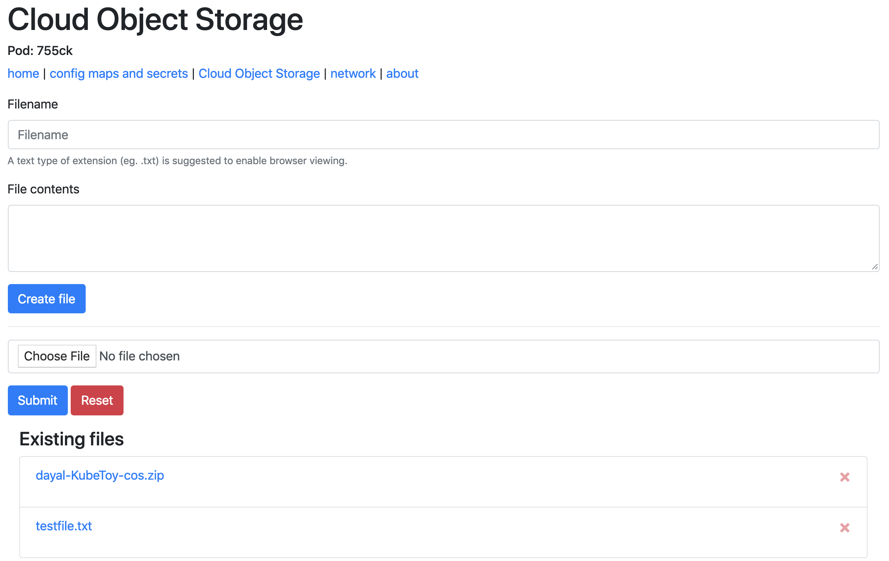

# Playing with IBM Cloud Object Storage

In this scenario we use the KubeToy application to interact with IBM Cloud Object Storage.

1. Populate COS connection details using one of the following paths
  ```
  {
    "apiKeyId": "some-long-string",
    "ibmAuthEndpoint": "https://iam.ng.bluemix.net/oidc/token",
    "serviceInstanceId": "crn:v1:bluemix:public:cloud-object-storage:global:a/ae5c212....",
    "bucket":"",
    "endpoint":"s3.us-east.cloud-object-storage.appdomain.cloud"
  } 
  ```
  1.  For local innerloop development, an example cos-credential.json example file can be populated and renamed to remove the *.example extension.  An `npm install` followed by an `npm start` should provide access to the running application within your local dev environment.  Assuming valid credentials were provided, Creation of a sample text file on the COS tabbed page should create an entry in the bottom list table.
  2.  For deployment into an ICP environment, updates to the configmap yaml asset to populate the corresponding ENV VAR values is necessary.  Assuming proper credentials, object creation and listings should be possible on the COS tab page.
2. Open up an instance of the KubeToy home page in a browser and browse to the Cloud Object Storage tabbed page.



You are able to perform create, delete and read operations on content that you can load into your COS bucket.

## Create
You can choose to create an object using either the web form to create a text document or via file selection to choose text or binary files.

## Read
For any listed items found in the bucket, you can click on the object's link to view the content or binary representation within the browser.

## Delete
For any listed items found in the bucket, you can click the red X to the right of the object to initiate a deletion of the target object from COS
