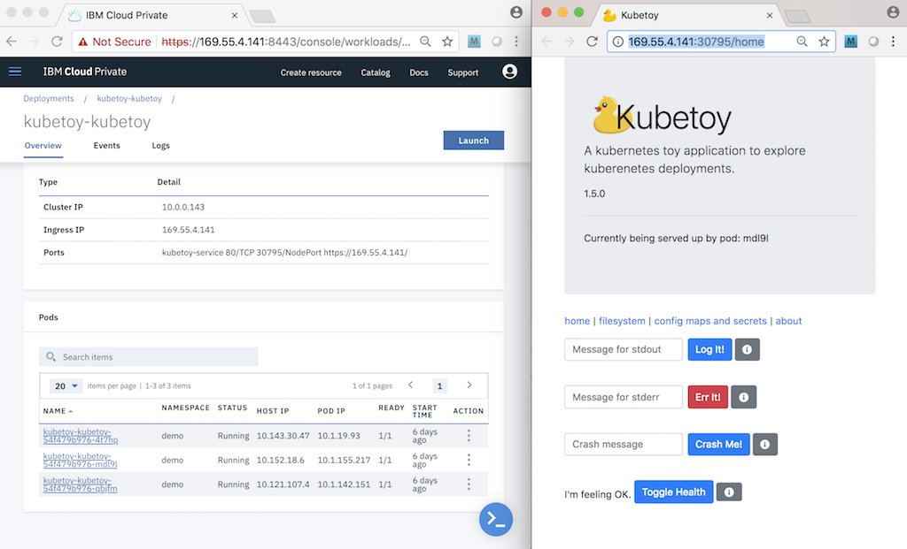
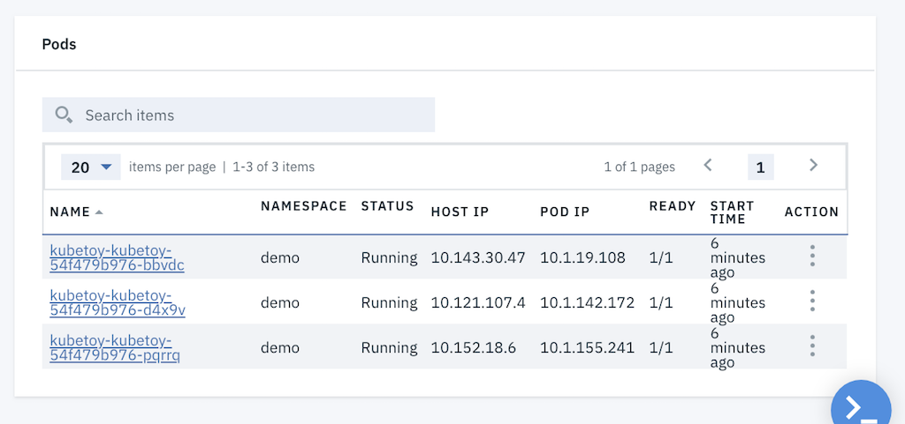
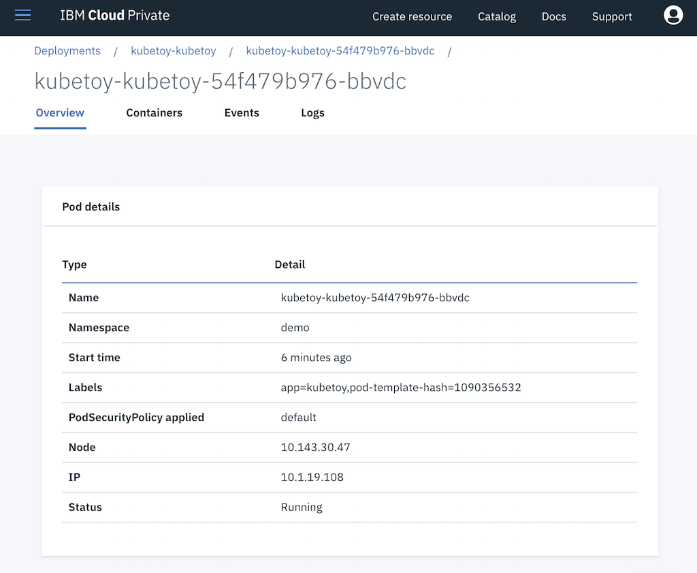
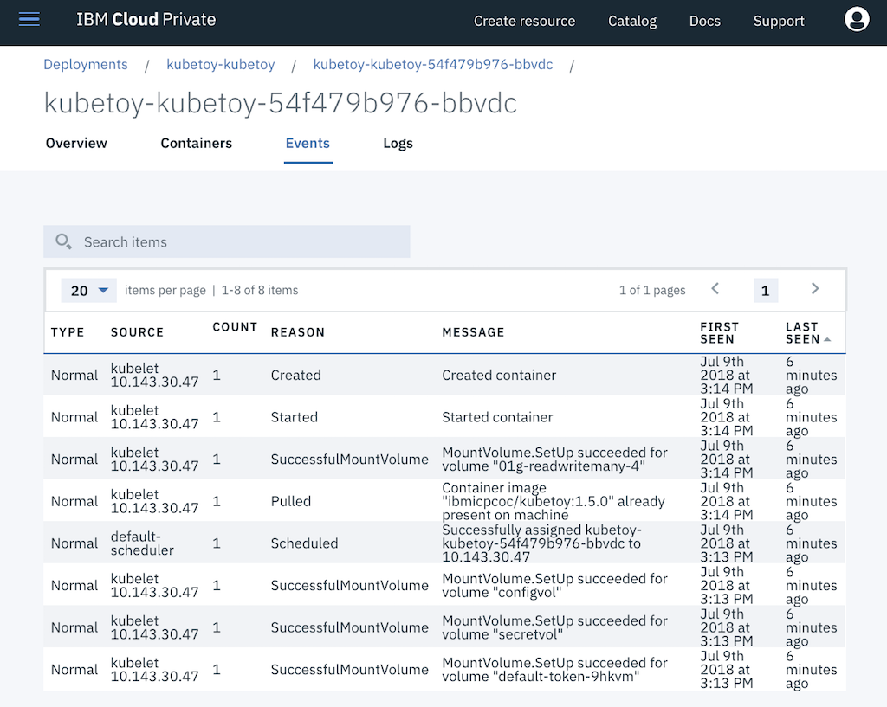
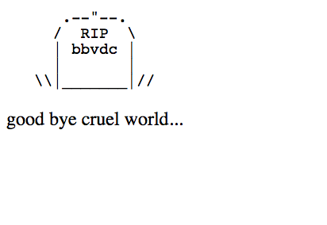
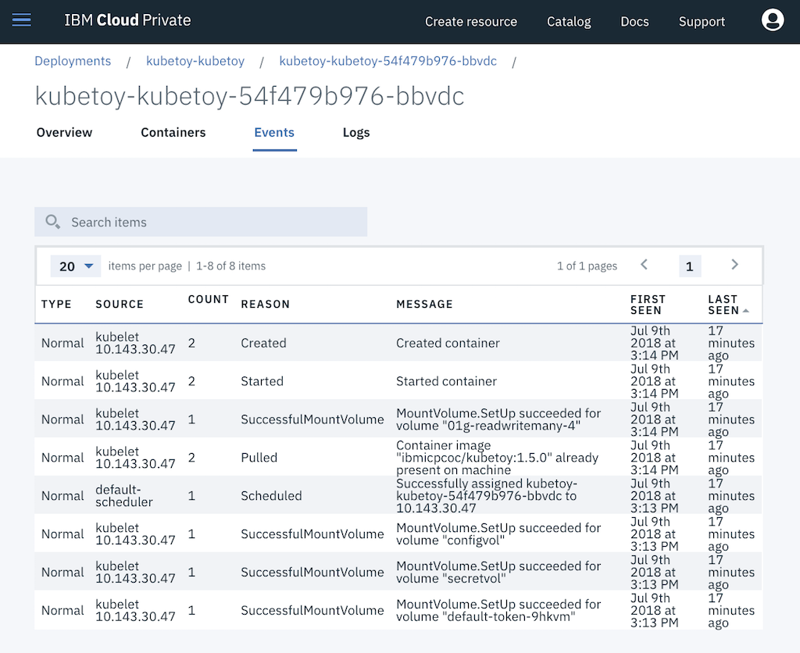
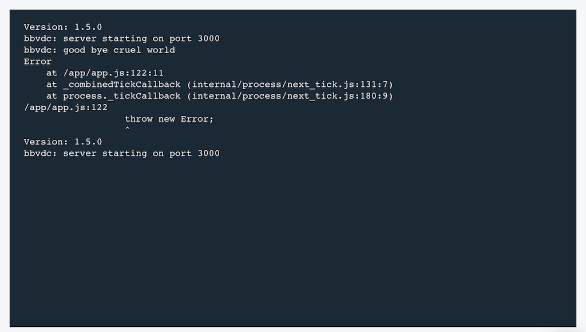

# Crash the App

In this scenario we intentionally crash the application and watch as Kubernetes restarts it 
to bring another instance on line.

1. This scenario is best observed when the ICP user interface and the KubeToy interface are 
being displayed side by side.  Arrange your widows so you can see both (like below).  The left 
instance of the browser is displaying the KubeToy deployment details (Main > Deployments > kubetoy ).
The right browser instance is the UI of the kubetoy app (Main > Network > Services > kubetoy > ui ).

2.  Scroll down to the bottom of the page to the Pods section.  You should see several instances 
of pods running. Note how they are distributed across different nodes (Host IP).  Kubernetes does this 
automatically for you, to help ensure robustness.  

3. Click on a pod link to see its details.

4. Click on the Event tab to see the events that this pod has experienced.  Note that if this is the first 
time you are using KuybeToy most of the event counts will be 1.

5. Click on the Logs tab to see the logs for that particular pod.

6. Go back to the list of the pods at the bottom of the Deployment details page for the app.

7. With the KubeToy app enter in a crash message next to the Crash Me! button, then press the 
button. This will cause the application to crash itself (by throwing an uncaught error).  You will 
see a small dying page message, and it is is the last 5 digits of the pod that actually died.

Keep a close eye on the pods in the ICP UI.  If you are quick enough you should see the pod that
died display 0/1 in the Ready column briefly, as Kubernetes replaces it with a new instance.  If 
you don't after a few seconds, you might need to verify by examining the events of that pod:

You should see the counter for Created Container, Started and Pulled now set at 2. This is because
Kubernetes needed to restart the pod due to the crash.

You will also notice the message in the logs:

