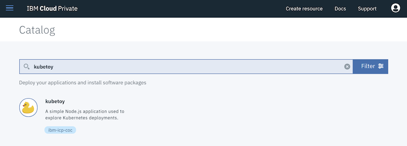
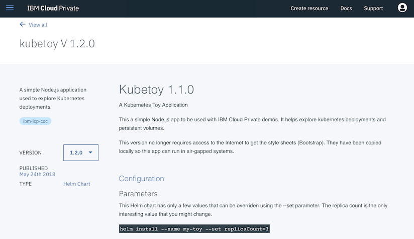
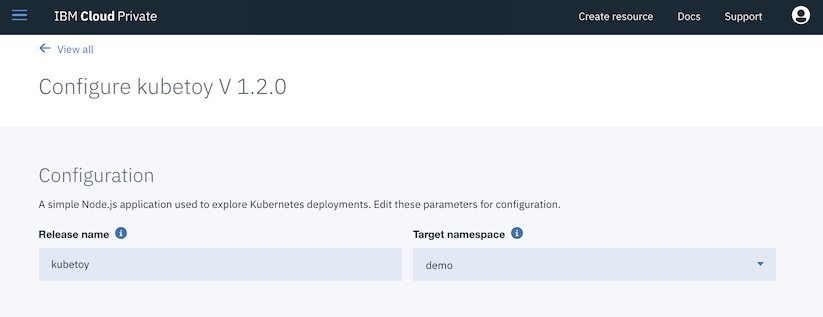
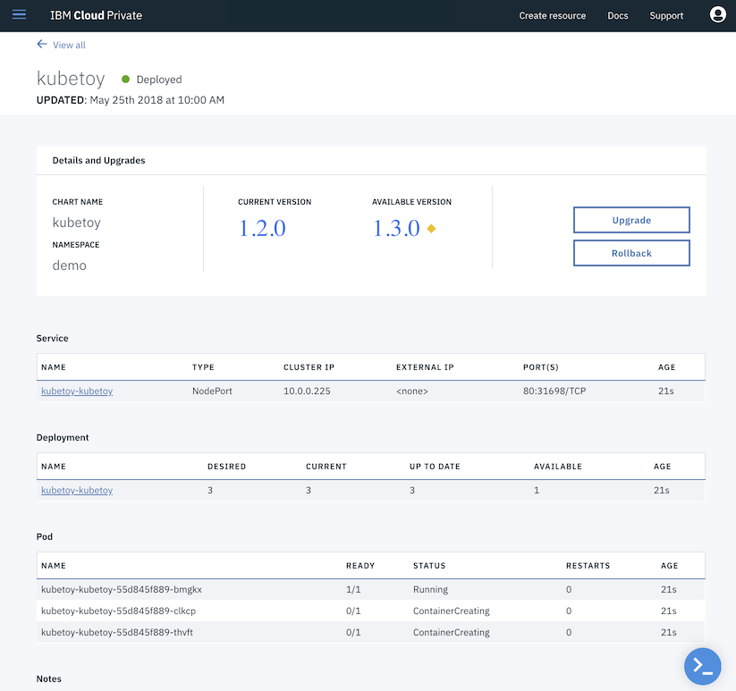
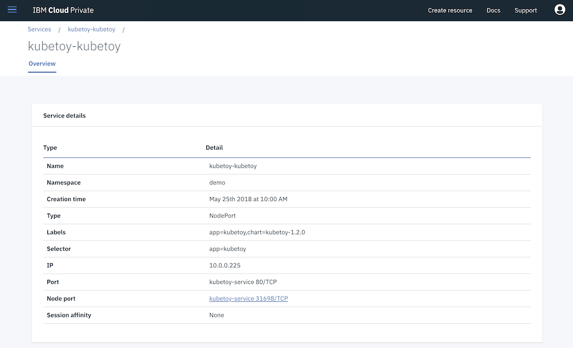
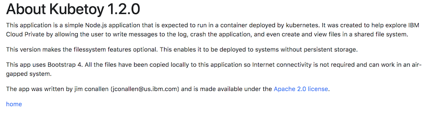
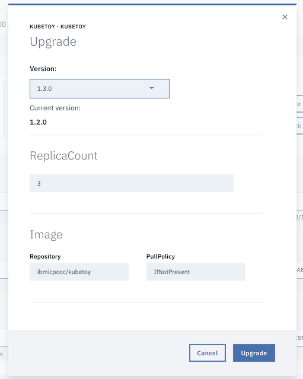
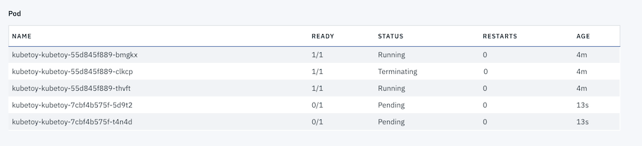
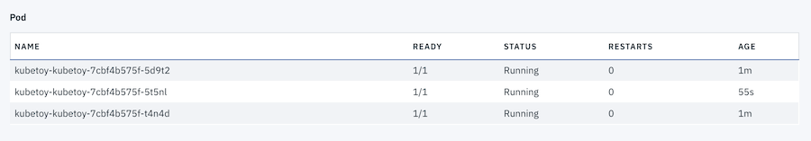
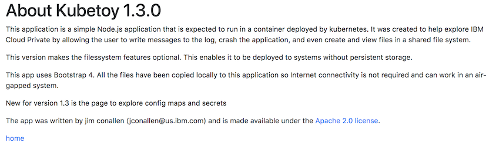

# Deploy KubeToy from Helm Catalog

In this scenario you will deploy the KubeToy application to ICP from the helm catalog. This scenario 
start with a next to the latest version of the app so that we can show how an app can be upgraded when 
newer versions become available.  

*Note: the screen shots shown here are from an earlier version of KubeToy.  The scenario will work for 
the most recently deployed versions, regardless.

1. Use the main menu to open up the catalog, **Catalog** > **Helm Charts**.  Search for the KubeToy chart.

2. Select the chart and change the version to 1.2.0. (Yes the the readme file says 1.1.0, this is a defect
in this particular version of the chart).

3. Add a name for this deployment, and select a namespace to deploy to.

4. Confirm the deployment and navigate to the Helm releases page.  Then select the KubeToy release.  
Notice the status of the pods at the bottom of the page, when at least one of them is running then 
it is OK to open up the app.

5. With at least one pod running, select the Service link to display the KubeToy service description.

6. Click on the Node port link to open up the app in another tab of the browser.  Then click on the 
about link of the application to verify the version of the application.

7. Navigate back to the Helm release page for this chart ( Workloads > Helm Releases, select KubeToy ). 
Then press the Upgrade button.  Select the latest version of the chart, and press Upgrade.

8. Notice the pods the status. The old pods will terminate and the newer version of the app is 
brought on line.  Kubernetes will only terminate old pods after the newer versions come on line.  For
a brief period both versions will be running, so if you are very quick you might be able to refresh 
the app in another browser and randomly see the older version appear.

Eventually all the old versions will be terminated, replaced by the new versions.

9. You can verify the latest version of the app is running by navigating to its about page.

