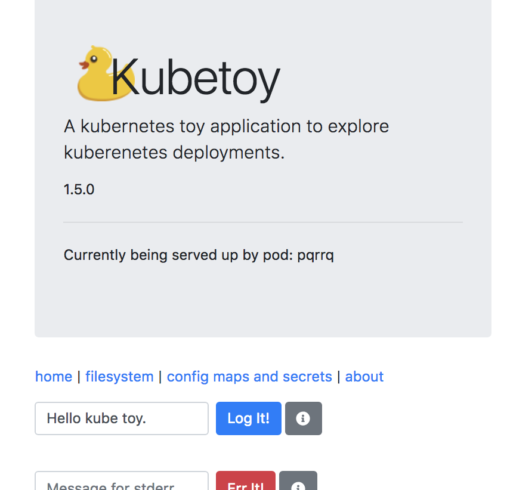
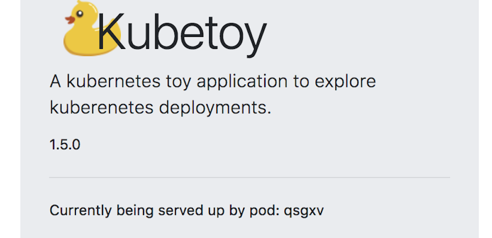
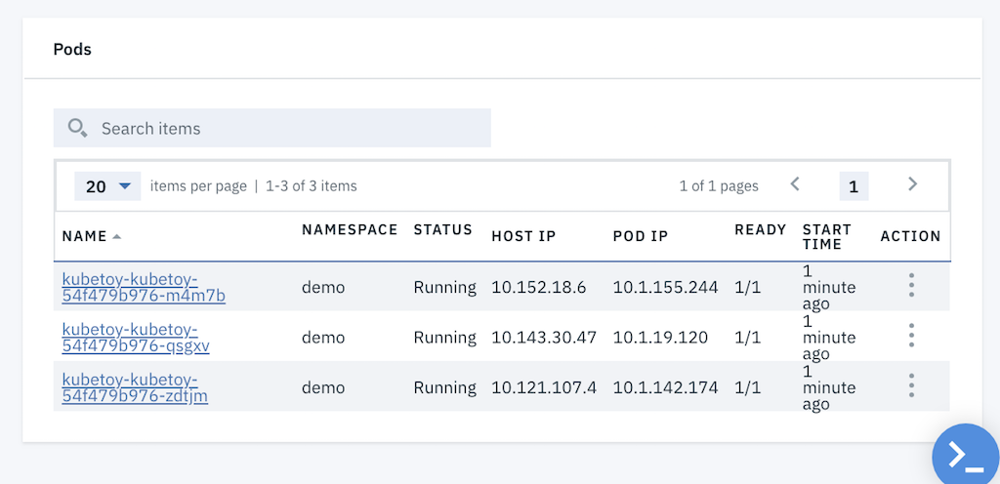
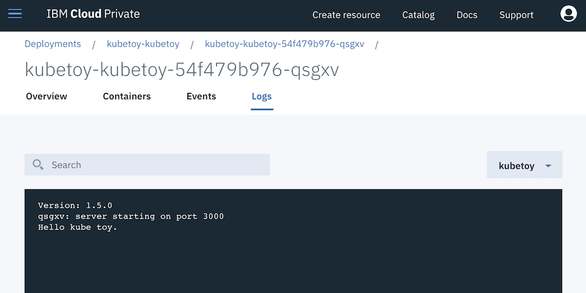
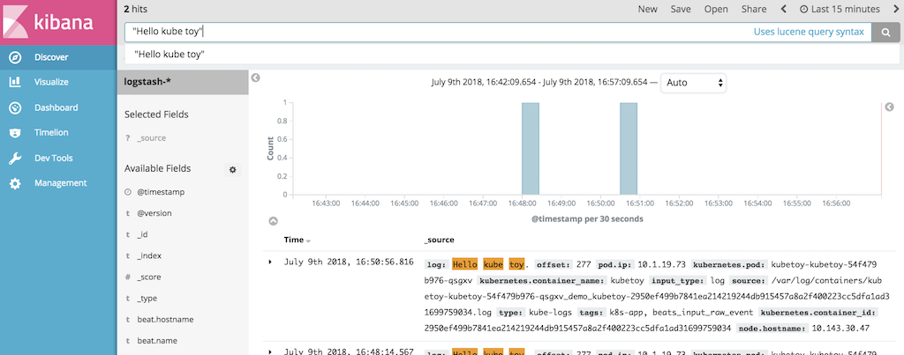
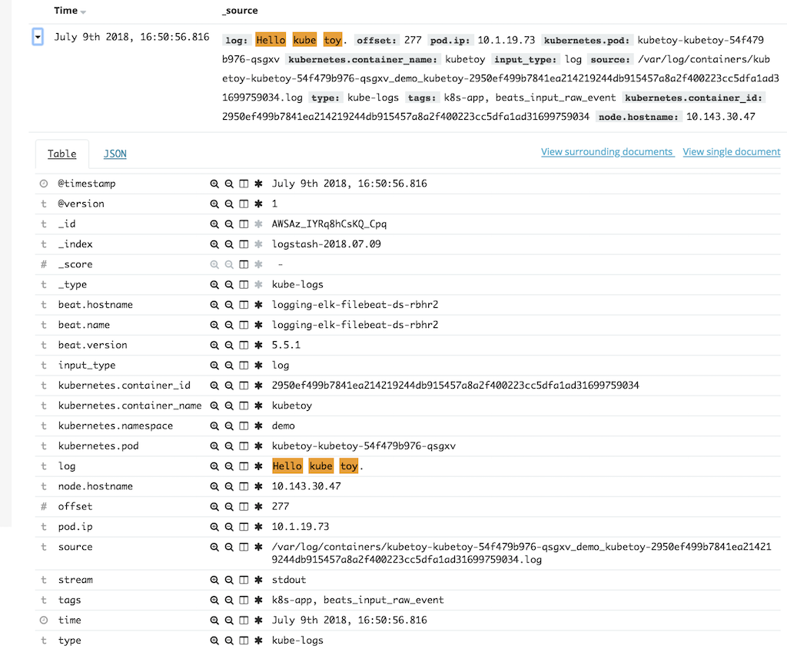
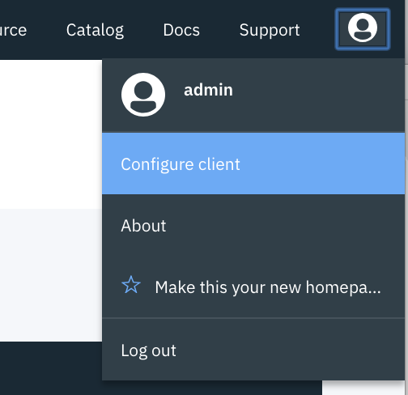
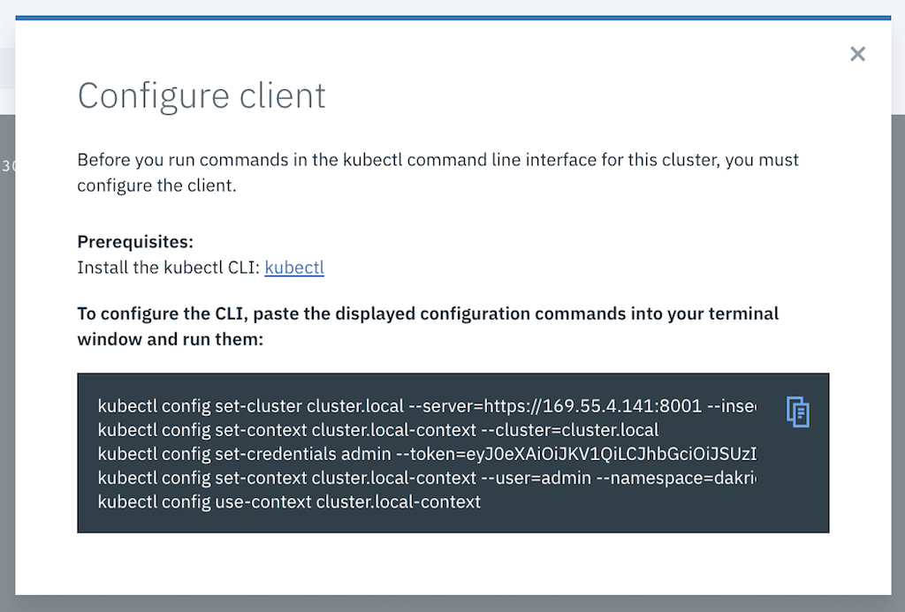
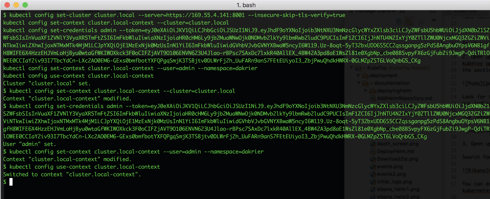

# Playing with the Logs

In this scenario we use the KubeToy application to write information to the logs 
and then view the logs with the UI, Kibana (and even the CLI).  If you want to use
the CLI you will need the Kubernetes CLI tools [installed on your workstation](https://kubernetes.io/docs/tasks/tools/install-kubectl/).

1. Open up an instance of the KubeToy home page in a browser.  Enter in a message in the 
   *Message for stdout* field and then press the Logit! button.
   


Take notice of the pod identifier that appears after you submitted the log message.



In this case it is ```qsgxv```.

2. Open up the ICP user interface and navigate to the deployment description of the 
kubetoy app (Workloads > Deployments ). Scroll down to the bottom of the page to 
the section labeled Pods.



Look for the pod name whose suffix matches the 
one indicated in the app after you pressed the LogIt button.

The latest entry in the log should be your message.



3. Open up the Kibana Log viewer from the ICP main menu (Platform > Logging)

Search for your message (place it or a part of it in double quotes) and display the details.



You can expand the log entry to see a lot of meta information most of which describes the kubernetes information.  



Note that the stream value indicates stdout. 

4. Back at the KubeToy application use the Message for stderr (Err It!) to send a message to 
stderr.  Verify it with the ICP UI (Workloads > Deployment) and Kibana as you did before.  In this 
case the only difference you will note is the steam is indicated as stderr in the Kibana interface.
Otherwise the log message appears just like stdout.

5. If you have the kubectl client installed then you can examine the logs from a command 
line.  First initialize your client by using the User menu in the upper right hand corner of the ICP UI to and select Configure Client.



6. Copy the text in the dialog (easiest to use the copy to clipboard icon).



7. In a terminal window paste the kubectl commands to set your local context.



8. Now with your context set you can execute kubectl commands.  Lets get a listing of all 
the pods running in the namespace ```demo``` (the namespace where we are running KubeToy).

```
$ kubectl get pods -n demo
NAME                                    READY     STATUS    RESTARTS   AGE
default-http-backend-7cb6955c76-mtw7m   1/1       Running   0          7d
kubetoy-kubetoy-54f479b976-m4m7b        1/1       Running   0          17m
kubetoy-kubetoy-54f479b976-qsgxv        1/1       Running   0          17m
kubetoy-kubetoy-54f479b976-zdtjm        1/1       Running   0          17m
sumapp-7bff68f546-hcpvl                 1/1       Running   0          7d
sumapp-7bff68f546-jv72v                 1/1       Running   0          7d
test1-7b595945b4-x9m8b                  1/1       Running   0          7d
```

9. Look for the pod whose trailing identifier matches that of the pod we know the 
log message was sent from.  Then display the logs using the kubectl command.  Don't 
forget to include the ```-n <namespace>``` argument.

```
$ kubectl logs -n demo kubetoy-kubetoy-54f479b976-qsgxv
Version: 1.5.0
qsgxv: server starting on port 3000
Hello kube toy.
```

The ICP UI and kubectl commands need to be told which pod to get the logs from.  The Kibana interface on the other hand manages logs from all applications (that your account has visibility to) and is more useful when trying to trace activities across multiple applications.

