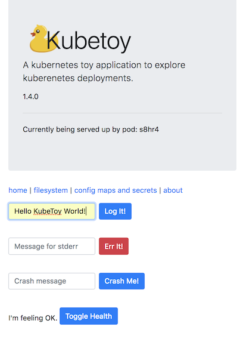
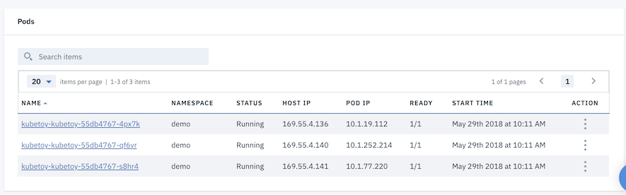
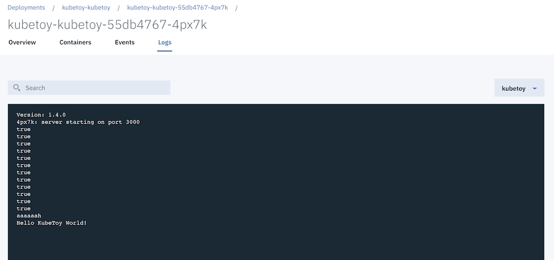

# Playing with the Logs

In this scenario we use the KubeToy application to write information to the logs 
and then view the logs with the UI, Kibana (and even the CLI).

1. Open up an instance of the KubeToy home page in a browser.  Enter in a message in the 
   *Message for stdout* field and then press the Logit! button.
   

Take notice of the pod identifier that appears after you submitted the log message.

2. Open up the ICP user interface and navigate to the deployment description of the 
kubetoy app (Workloads > Deployments ).  Look for the pod name whose suffix matches the 
one indicated in the app after you pressed the LogIt button.

The latest entry in the log should be your message.

3. Open up the Kibana Log viewer from the ICP main menu (Platform > Logging)

Search for your message (place it or a part of it in double quotes) and display the details.

There is a lot of meta information describing the kubernetes information.  The stream value
should indicate stdout. 